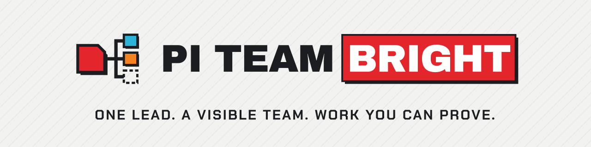

<p align="center"></p>

# Pi Team Bright

**Delegate work to a visible Pi team without turning terminal activity into your
source of truth.**

Pi Team Bright lets one Pi lead assign durable Tasks to stable, named Workers.
Workers remain visible through terminal adapters, but the work lives in the
Task: who owns it, what done means, and the evidence that achieved, failed, or blocked its goal.
The lead can wait for changes instead of watching panes.

Website: <https://deephbz.github.io/pi-team-bright/>

## Watch the demo

[](https://github.com/deephbz/pi-team-bright/releases/download/v0.20.0/pi-team-bright-promo.mp4)

[Play the video inline in the release notes](https://github.com/deephbz/pi-team-bright/releases/tag/v0.20.0#watch-the-demo)
· [Download the MP4](https://github.com/deephbz/pi-team-bright/releases/download/v0.20.0/pi-team-bright-promo.mp4)

## From terminal juggling to accountable delegation

Suppose a release needs two things at once: an API-contract audit and a rollback
checklist update.

**Before:** the operator opens extra terminals, pastes two prompts, and watches
scrolling output. One process exits and another looks busy, but there is no
reliable answer to “Who owns which result?”, “What is still blocked?”, or “What
proved completion?”

**With Pi Team Bright:** the lead ensures an `auditor` and a `writer`, then
creates one assigned Task for each outcome with explicit acceptance criteria.
The auditor reports `goal_achieved` with file-and-command evidence. The writer
blocks with the missing decision, blocker evidence, and a next action. The lead observes those
state changes through `team_sync`, resolves the blocker, and reviews the Task
evidence before stopping either Worker.

A pane, process, launch receipt, or startup observation may show that a carrier
exists. None of them proves that a Worker is ready, making progress, or done.
The Task plus its assignee is the only executable work contract.

The one lead is both project lead and coordinator. The project lead preserves user
intent and constraints, chooses the approach, decomposes work, evaluates outcomes,
and explains trade-offs. The coordinator assigns Tasks, supplies context, resolves
blockers, supervises outcomes, and escalates decisions. Delegation does not
transfer accountability or the user's authority.

## The normal flow

The normal sequence is:

restore or create the Team → reuse or ensure Workers → `task_graph_apply` →
snapshot and updates through `team_sync` → inspect goal evidence → resolve
Tasks. Stop Workers or shut down the Team only when their lifecycle boundary
ends.

Configure a model role and its default using the [canonical settings example](docs/examples/pi-team-bright.settings.json). A minimal agent-led run looks like this:

```js
team_create({ name: "review", purpose: "Audit the recovery contract." })

ensure_worker({
  name: "auditor",
  scope: "Contract reviewer who reports reproducible evidence."
})

task_graph_apply({
  operation_id: "audit-recovery-contract-1",
  tasks: [
    {
      key: "audit",
      title: "Audit the recovery contract",
      goal: "Compare implementation with the documented recovery path and report exact evidence.",
      assignee: "auditor"
    },
    {
      key: "repair",
      title: "Repair a failed contract",
      goal: "Apply the smallest coherent repair and report focused verification evidence.",
      assignee: "writer",
      needs: ["audit"]
    },
    {
      key: "verify",
      title: "Verify the repaired contract",
      goal: "Independently verify the repair and report the acceptance result.",
      assignee: "auditor",
      needs: ["repair"],
      on_goal_failed: { target: "repair", max_traversals: 2 }
    }
  ]
})

team_sync({ view: "snapshot" })
team_sync({ view: "updates" })
```

Use the initial `team_sync` snapshot to reconcile the Team, then use updates
for event-driven supervision. Inspect the authoritative Task and its evidence
after a change. A Worker reports `goal_achieved` or `goal_failed` with evidence,
or blocks with a next action. A blocked Task requires an explicit resolution, not an inference
from terminal output.

Team, Worker, and Task have different lifecycles. Align a long-lived Team with
one project or durable coordination boundary. A Worker owns a coherent semantic
role or an intentionally isolated perspective; a Task owns one bounded outcome.
Reuse current Workers unless another Worker unlocks independent parallel work,
establishes a distinct reusable scope, or provides deliberate context isolation.
Keep implementation, execution, diagnosis, and repair with one Worker when that
causal context matters; use a fresh Worker for independent review when a fresh
perspective matters. Before `worker_stop`, resolve every nonterminal assigned
Task and reconcile once more. Never infer Team shutdown from completed Tasks,
an empty ready front, or idle time.

Use `team_sync({view:"updates"})` when the lead needs to wait for Worker results.
The framework keeps that wait open while a current Worker is active. Internal
wait deadlines trigger a new evidence check without another model call.
`caught_up` reports no new change and no current Worker producer that requires
a wait. Unfinished Tasks can still need action. `unsettled` lists Workers whose
activity, pending actuation, or missing evidence needs attention. A zero wait
returns `unsettled` after one immediate recheck if a Worker remains active.
Updates without a baseline return a snapshot. A duplicate sync in one message
is refused; use the other call's result.

The framework also collects unseen changes when the lead finishes a reply.
Automatic sync batches them by a maximum delay or an update-count threshold.
A new batch resumes the settled leader once. Empty checks and unfinished Tasks
alone do not start turns. Use `/ptb sync` for one immediate check: changes arrive
as a framework-executed `team_sync` result; an empty check displays “No updates”
in the TUI without a model turn. Native Session history records framework origin;
the provider context receives the corresponding tool call and exact tool result.
The observation cursor advances after a successful provider turn. An automatic
delivery gets one retry after provider failure. Repeated failure pauses delivery
for that batch and shows a warning. Use `/ptb sync` after recovery. Cancelling
a turn also leaves that batch available for a manual check.
Update delivery uses bounded event pages. The first observation on a branch
still sends a complete Team snapshot; a large Team can require substantial
model context.

If no actor can progress, name the blocker and next actor. Task completion does
not stop the Team or its future update monitoring.

Task assignment and goal or dependency changes belong in the Task graph, not in
Alerts or context updates. Alerts are only for exceptional clarification,
attention, or announcements. They never assign, advance, block, or complete work,
and they are not a chat-based substitute for Tasks.

## Diagnose a Team problem

Run `/ptb doctor` to send the repair guide and Team metadata observed at
invocation to the agent. The command starts a diagnostic turn. During an active turn, Pi queues
it as a follow-up. Use `/ptb doctor <team-name>` to inspect a named Team from
an unbound Session. Selection does not join the Team.

The command reads local metadata and changes no Team state. The agent checks
fresh evidence before a repair. Missing or damaged Team records remain visible
in the diagnostic context. `/ptb` opens the command palette. `/ptb help` shows usage without a model turn.
Other PTB slash commands keep their current names.

## Mission graph semantics

`task_graph_apply` atomically applies the complete assigned Task graph. On the
first revision, omit `expected_graph_version`. Later revisions must supply the
exact current graph version. Success edges in `needs` remain acyclic. An
explicit `on_goal_failed` edge may return to earlier repair work, but its
traversal limit must be from 1 through 8.

Only `goal_achieved` satisfies a prerequisite. `goal_failed`, `cancelled`, and
`blocked` never release a success edge. `dependency_waiting` and `ready` are
derived states and cannot be authored. Every claim starts an immutable Attempt,
and joins bind the accepted Attempt lineage of all prerequisites.

Task authority presents at most one ready Task to each stable Worker. Different
Workers can execute the ready front in parallel. Several unordered ready Tasks
for one Worker remain queued; add `needs` edges when their order matters.

In Herdr, `/ptb graph` opens or closes a read-only Task pane in the exact
current tab. An optional limit is `25`, `50`, `100`, `200`, or `all`.

The pane opens in DAG view. Press `v` to switch between DAG and Timeline.
Both views use the same Task source and keep the selected Task, recent limit,
and state filter. Press `Tab` for pan or selection mode, `f` to change the
recent limit, `s` to change the state filter, and Enter for Task details.
The DAG supports TB and LR layouts and disconnected islands.

Timeline shows one row per Attempt, including retries. Its bars show elapsed
calendar time with separate running and blocked segments. Active Attempts have
an open end. These times come from recorded Task transitions; they do not
measure model effort or prove that a Worker process is alive. Older Attempts
without complete timing show `timing unavailable`. In Timeline, `+` and `-`
zoom time, arrows pan, and Home restores the full time span. Neither view schedules or
changes a Task.

## Candid limits

- **This is Team-scoped coordination.** It is not a general agent directory,
  cross-Team router, universal chat bus, or freeform work-by-message system.
- **Terminal capabilities vary.** Herdr and tmux enforce the Team pane-placement
  invariant: the first Worker splits the exact leader pane right with a measured
  ratio that keeps the leader at least at its configured share. Linear placement
  preserves its exact current-Worker target and downward split. Herdr adaptive
  placement reads live rectangles, considers only registered Workers in the
  leader tab and Worker region, ranks candidates by `max(width / columns_per_row,
  height)`, and splits the longer visual dimension at 50/50. It skips a candidate
  when either child would be below 20 columns or 5 rows, then reports insufficient
  geometry when no candidate remains. Ties use pane ID order. The legacy `grid`
  value remains readable as an alias for adaptive placement; new layouts can use
  `adaptive` and need no fixed grid shape. An optional `worker_limit` caps current registered Worker
  Memberships; omitted preserves the historical unlimited behavior. Every target
  is checked against the leader tab and Worker region. Adapters never use terminal
  focus, select a whole-window layout, or close another pane during Worker stop.
  iTerm2, Zellij, cmux, WezTerm, and Windows preserve their existing placement
  behavior but do not guarantee this exact target-and-ratio invariant.
  Herdr owns the `pi` executable used by `agent start`; a real Herdr Team must
  configure that executable to a supported Pi release (0.83.x or later). Pi 0.83 or later is required for
  exact Worker run-state evidence. Launching a supported local Pi only for the leader does not change
  Worker Pi. Workers load the exact Pi Team Bright extension and retain Pi's
  normal unrelated extension and Skill discovery. A distinct discovered Pi Team
  Bright copy violates the one-version-epoch rule and remains a documented
  installation risk. Herdr forwards the established Pi launch environment
  allowlist into Worker launches. Team creation names the recorded leader pane
  `<team name>-leader`. A naming failure warns without blocking Team creation.
  It names the exact pane returned by the split
  with the stable Worker name before agent startup. A presentation-label failure
  is warned and traced but does not block Worker coordination.
  Placement remains Team-wide policy, never a per-Worker override; an unsupported
  policy is refused.
- **Package version is not Team storage compatibility.** Existing Team records
  remain usable across compatible upgrades and rollbacks. Historical
  `implementationVersion` values are accepted as provenance, not used as a
  capability gate.
- **Visibility is not progress.** Launch, delivery, process, runtime, pane, and
  window evidence is bounded evidence about those things only. Likewise,
  `/ptb status` and `/ptb help` provide bounded local
  diagnosis; they are not Worker health, readiness, or progress checks.
- **Beads list contention is unresolved.** While live Workers settle Tasks,
  ordinary `team_sync` can intermittently time out in the underlying Beads
  `list` command. Do not interpret that timeout as an empty Task set, Worker
  failure, or lack of progress; preserve the last valid cursor and reconcile
  from authoritative state when the read is available.
- **The packaged operating skill is named `pi-team-bright`.** Its discovery
  name now matches the product, command, and npm package.

## Install and upgrade

Install the stable release by exact version:

```sh
pi install npm:@hypercarrier/pi-team-bright@0.20.0
```

Version `0.20.0` is backward compatible with `0.19.0` Team state. It adds the
`/ptb` command palette, validated editing of scoped settings, and one transcript
presentation for PTB messages. The old command names remain aliases. Restart Pi
to load it; do not recreate a Team for this update. See the
[v0.20.0 release notes](docs/release/v0.20.0-release-notes.md).

Version `0.19.0` replaces model profiles and raw model defaults with named
model roles. This is a breaking Worker-creation change. Finish or stop live
Teams under their original version. Preserve their Team stores and native Pi
Session logs. Update settings to `model_roles` and `default_model_role`, then
start new Team epochs under `0.19.0`. Do not reload `0.19.0` into a live Team
from an older release. See the [v0.19.0 release notes](docs/release/v0.19.0-release-notes.md)
and the [upgrade steps](#upgrade-from-model-profiles).

Version `0.18.0` added Worker model profiles and removed per-Task model
selection. Its [release notes](docs/release/v0.18.0-release-notes.md) preserve
that earlier upgrade boundary.

Version `0.17.0` replaces the leader tool `task_create` with
`task_graph_apply`. It also replaces authored Task status changes with explicit
transitions such as `claim`, `block`, `resume`, `goal_achieved`, and
`goal_failed`. Update saved prompts or scripts that call the old contract.

Versions `0.17.1` through `0.17.5` are backward compatible with `0.17.0` Team
state. Version `0.17.1` resolves the live Herdr graph-pane origin. Version
`0.17.2` uses Herdr's official interactive-ready Worker command with a six-second
readiness timeout. Version `0.17.3` names the exact split Worker pane before
Agent startup. Version `0.17.4` starts the leader's recipient-delivery pair on
initial Team creation and makes full shutdown end the exact lead binding. Version
`0.17.5` makes Team and Worker topology selection explicit in the packaged
operating skill. It also gives the one lead project-lead and coordinator
responsibilities, and directs interim replies, progress notes, and blocker
escalations to end with `team_sync({view:"updates"})` while assigned nonterminal
Tasks remain. This is operating guidance, not runtime enforcement. These patches
do not change Team storage, Task graph, model-tool, or Worker protocol contracts.
Do not recreate a Team for these updates.

The package owns its local Task backend through the exact runtime dependency
`@beads/bd@1.1.0`; a separate global `bd` installation is not required.

For an upgrade or rollback, restart each Pi process that must load the chosen
extension. Follow that release's Team boundary. Compatible patches do not
require Team recreation; `0.19.0` requires new Team epochs for the model-role
contract.

## Team pane layout settings

Set the optional Team policy under `pi_team_bright.team` in global
`settings.json` or a trusted project's `.pi/settings.json`. Pane layout values
use trusted-project precedence. Sync liveness values are global only. The
[canonical settings example](docs/examples/pi-team-bright.settings.json) contains
Team, Worker, and model-role settings.

`leader_share` is the fraction kept by the leader after the first Worker split.
It must be greater than `0.1` and less than `1.0`; the default is `0.6`.
`team_create.pane_layout` takes precedence over trusted project settings, then
global settings, then `{ "leader_share": 0.6, "worker_tiling": "linear" }`.
Herdr supports `linear`, `adaptive`, and the read-compatible `grid` value; other
pane backends support `linear` only. Adaptive placement uses
`columns_per_row: 2` when omitted and the fixed minimum of 20 columns by 5 rows.
Set optional `worker_limit` in `pane_layout` to cap current registered Workers;
omitting it keeps the historical unlimited behavior. The resolved policy is
stored in `TeamConfig`, so later settings changes do not move a live Team.
`wait_seconds` defaults to `120` and controls the internal
liveness recheck interval. Automatic synchronization defaults to enabled and
flushes after 20 seconds or three unseen projected changes. Several events
for one Task can count as one change. Configure
`auto_sync_enabled`, `auto_sync_delay_seconds`, and
`auto_sync_update_threshold` in the global Team settings. Invalid values use
validated defaults and produce a settings diagnostic. The old `nudge_enabled`
and `nudge_delay_seconds` names are deprecated fallbacks when their replacements
are absent. An existing explicit disable remains disabled.
Existing Teams keep their stored policy, including an older delay. Stop and
recreate the Team to apply a new policy.

## Worker model roles

A model role names one execution choice and its intended use. Worker scope and
Task goals define the work. A model role does not grant authority or install
prompts, tools, or skills. It never changes the leader's model.

Start with the [canonical settings example](docs/examples/pi-team-bright.settings.json).
It is shipped in the package and is the only maintained JSON example.
Merge the complete example's `pi_team_bright` entries into the active Pi agent
directory's `settings.json` (`PI_CODING_AGENT_DIR`, normally `~/.pi/agent`).
Preserve unrelated Pi settings. A trusted project's `.pi/settings.json` can
override model roles, their default reference, Worker resources, and pane layout.
Keep sync wait and automatic-sync settings global; copying them into project settings
produces a scope warning. Run
`pi --list-models` and replace the example model references with exact available
`provider/model-id` values. Model IDs may contain additional slashes. Select
thinking levels supported by those models.

`model_roles` maps names to `model`, `thinking`, and `use` entries.
`default_model_role` references one existing name. Both explicit selection and
omission resolve through that map. If no default is configured, select a role
explicitly. An invalid or missing selection refuses before Worker creation;
there is no raw-model or Pi-native fallback.

```js
ensure_worker({
  name: "second-opinion",
  scope: "Independent judgment of plans and deliverables from a reading bundle.",
  model_role: "second-opinion"
})
```

Team creation and snapshots show model role names, usage guidance, and the
configured default. Routine updates omit the catalog. Invalid selections return
valid choices. A trusted project's entry replaces the complete global entry of
the same name. An invalid project override remains invalid; it does not reveal
the global definition. The default resolves against this effective map.

The Worker retains its initial binding across Tasks. Editing, deleting, or
renaming a model role affects future creation. Reuse keeps the stored binding;
a conflicting explicit selection refuses. A human can change the runtime model
or thinking level in the Pi pane. Same-Session recovery preserves Pi's recorded
selection. Initial binding details are configuration evidence, not a claim about
the current runtime model. Tasks have no model selector.

### Upgrade from model profiles

Version `0.19.0` replaces the `0.18.0` model-profile contract.
Finish existing live Teams under their original version before switching.
Preserve their stores and native Session logs.

1. Rename `model_profiles` to `model_roles`.
2. In each entry, join `provider` and the old `model` with `/`, store that
   reference in `model`, and remove `provider`. Keep `thinking` and `use`.
3. Set `default_model_role` to the intended entry name. Remove
   `worker.default_model`. A role name alone does not make that role the default.
4. Update saved Worker calls from `model` to `model_role`.
5. Install `0.19.0` and restart Pi. Address any settings warning, then start
   new Team epochs before creating Workers.

A legacy Team with a raw model default cannot create new Workers through this
contract. The refusal directs the operator to finish the old Team with its
original version or create a new Team. Existing binding and Session evidence
remain readable. Configuration changes never rewrite Team stores or user files.

### Configuration warnings

Pi startup and reload use Pi's native warning notification and theme warning
color. The warning includes the affected field, source, consequence, and
canonical example path. Repair the settings and reload Pi to stop new warnings.
The warning does not start a model turn or enter model-visible Session history.
Pi remains usable; a dependent invalid Worker selection still refuses.
An absent extension configuration produces no warning during standalone Pi use.

## Worker resource settings

Worker-only prompt and tool projection uses `pi_team_bright.worker` in the same
Pi settings files. Trusted-project values take precedence. The canonical example
leaves optional prompt paths and tool lists empty. Supply absolute `agents`
paths and registered tool names when needed. Model selection belongs to the
model-role map and its default reference.

Both `agents` paths are optional and must be absolute. The four cases are:

- Neither: native global plus ancestor/project context stays unchanged.
- `append_global`: native global plus ancestor/project context, then the append file.
- `replace_global`: the replacement file, then native ancestor/project context.
- Both: the replacement file, native ancestor/project context, then the append file.

An unreadable `replace_global` warns and restores the native global contribution.
An unreadable `append_global` warns and skips only the append file. Pi Team Bright
serializes an active aggregate in a private temporary file and launches Workers
with `--no-context-files --append-system-prompt`; Pi reports appended content and
`getAgentsFiles` is empty.

### Tool-list precedence

Tool projection starts with the Worker's inherited active tool list. It then
adds registered tools named in `enable` and removes registered tools named in
`disable`. Thus, `[A, B, C]` with `enable: [E]` and `disable: [C]` becomes
`[A, B, E]`, not `[E]`. If both lists name the same tool, `disable` wins.
Unknown names are ignored with a Worker diagnostic. Settings cannot restore
leader-only tools to a Worker.

Tool projection changes only the model-visible active set. It never grants
authorization: core services, including Alert authorization, still reject
forged or prohibited calls.

A saved Pi trust decision controls project settings. A trusted Worker gets
`--approve`. An untrusted or unknown Worker gets `--no-approve`; an unknown cwd
uses global settings only and warns. Save trust then restart.
The aggregate covers normal and Task-delivery trigger turns. On Worker reload,
Pi Team Bright atomically refreshes the fixed aggregate path. If both paths then
disappear, it restores serialized native global plus ancestor/project context.
A final Worker shutdown removes its aggregate on a best-effort basis. A failed
launch removes it only when no carrier exists or terminal stop is confirmed. If
a carrier can remain live, Pi Team Bright retains its aggregate lease. Restart
without an aggregate restores Pi's native `getAgentsFiles` metadata. The lead is
unchanged.

## Architecture and authority boundaries

Pi Team Bright keeps coordination concepts separate so that convenient
observations do not become accidental authority:

| Concern | What it means |
|---|---|
| **Team and Membership** | The durable roster, lifecycle, current Membership generation, and Team-wide placement policy. |
| **Pi Session identity** | The exact conversational Session bound to a current Membership; a matching name, process, pane, or environment variable is not identity proof. |
| **Task authority** | Durable graph revisions, Task goals, assignments, Attempts, versions, outcomes, and evidence. The graph-native path uses a Team-scoped snapshot; Beads remains a legacy pre-graph fallback. |
| **Delivery** | Presentation of a Task change or Alert to one exact Session. A delivery receipt never changes Task state. |
| **Runtime observation** | Bounded evidence that an exact Membership process generation was observed. It does not prove readiness or progress. |
| **Terminal surface** | An adapter-owned pane or window carrying a Worker process. It is replaceable and is neither Worker identity nor work state. |
| **Events and `team_sync`** | The projection, cursor, and wait boundary that wakes the lead. Events report changes; Team and Task authorities still own current state. |

Terminal surfaces may be replaced while the stable Worker and its assigned Task
remain the coordination concepts the operator reasons about. Exact schemas,
guards, and lifecycle behavior live in executable contracts rather than this
README.

## Security and local data

Pi packages run with **full system access** as the user running Pi. Pi Team
Bright is not a sandbox: review the package and release before installing it,
and only run Workers in directories they should be allowed to access.

Team/Membership configuration, event and delivery records, runtime observations,
and the Team-owned Beads Task data are local machine state. Terminal adapters
also control processes and surfaces in their host applications. Treat those
files, processes, prompts, and Task evidence according to the sensitivity of
the project.

Report suspected vulnerabilities privately as described in
[SECURITY.md](.github/SECURITY.md); do not open a public vulnerability issue.

## Command palette

Run `/ptb` in interactive Pi. Use Tab and Shift+Tab to switch Actions, Models,
Team, and Workers. Use arrow keys to select a row, Enter to choose, and Escape
to cancel. Actions include status, sync, graph, doctor, settings diagnostics,
and command help. Doctor starts or queues a model turn; sync can continue the
leader when changes exist.

Direct commands use the same handlers:

```text
/ptb status
/ptb sync
/ptb graph [25|50|100|200|all]
/ptb doctor [team-name]
/ptb settings [global|project]
/ptb settings check
/ptb help
```

Settings show the edited scope and file. Global editing writes only
`pi_team_bright` in Pi's global `settings.json`. Project editing requires Pi
project trust and writes `.pi/settings.json`. Scope selection does not remove
other overrides. Unset fields show `Not set here` or `No project override`; the screen shows
values in the selected file, not a live Team's effective configuration.

Choose common values with the pickers, or use **Edit PTB configuration JSON**
for the full namespace. Each edit requires Save confirmation. Cancel leaves the
file unchanged. Invalid settings or a file changed since opening refuse the
save. Other Pi settings remain intact. Sync policy is global-only and applies
to new Teams. Pane layout applies to new Teams. Model-role changes affect new
Workers; existing Worker model bindings stay unchanged. Worker resources apply
when a Worker process starts. These edits do not change live Team records.

In RPC or headless mode, bare `/ptb` shows help. Use explicit commands for
non-interactive work; configuration editing requires the TUI. The old
`/pi-team-bright`, `/teamsync`, `/pi-team-graph`, and
`/pi-team-bright-settings` names remain compatibility aliases.

## Review the terminal displays

From a source checkout, run `npm run review:tui` to inspect PTB message scenes
one by one. Run `npm run review:graph` for the production DAG pane with mock
Tasks, or `npm run review:graph -- --view timeline` for mock Attempt bars.
Both programs use production rendering with fixed local fixtures. They need no
model, Team, Beads database, or terminal multiplexer.

The [TUI review guide](docs/maintainers/tui-review.md) explains the controls,
text exports, reusable components, coverage, and required fixture updates when
an interface changes.

## Verification and exact contracts

From a source checkout, use the verification lane appropriate to the change:

```sh
npm run typecheck
npm test
npm run test:full
npm run verify:package
```

`npm test` is the fast deterministic lane; `npm run test:full` includes the
broader suite, and `npm run verify:package` probes the packed public artifact.

`npm run verify:formal` runs bounded TLA+ models and negative controls. It needs
Java and the pinned TLC jar. See [formal verification](formal/README.md) for
setup, bounds, source mapping, and limits.

For current stage, constraints, and open work, read the
[maintained context](docs/current/README.md). For one-hop links to tool schemas,
authority implementations, types, event semantics, adapters, and focused tests,
use the [contract source map](docs/reference.md).

## Credits

Pi Team Bright is maintained by the HyperCarrier project. It derives from
[pi-teams](https://github.com/burggraf/pi-teams) by Mark Burggraf, a Pi port of
[claude-code-teams-mcp](https://github.com/cs50victor/claude-code-teams-mcp)
by Victor (`cs50victor`). The original MIT copyright notice is retained in
[LICENSE](LICENSE).

## TODO

- Isolate Task projection availability from valid Team and Worker carrier state
  when the underlying Beads list read is contended.
