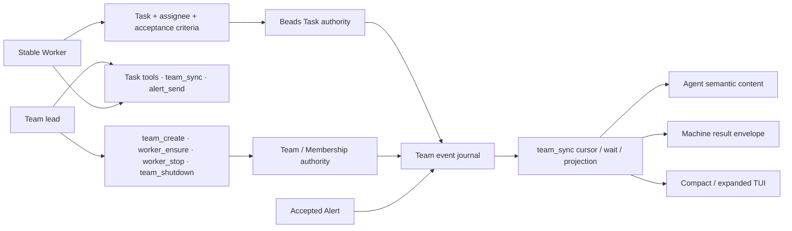

# PiTeams evergreen context

Updated: 2026-07-17

Lifecycle stage: **hardening** for the Task-first coordination surface;
**sharing** begins after human review, merge, and a stopped-Team release epoch.

This is the maintained context a new human or agent should read first. It
contains only intent, decisions still in force, current status, constraints,
and next steps. Executable contracts live in source and tests; dated attempts
and observations live in the [journal](../journal/).

## Product intent

PiTeams turns one Pi Session into the lead of a Team of stable Workers. A Task
plus its assignee is the only executable work contract. `team_sync` is the
event-driven observation and wait boundary. Typed Alerts are exceptional
clarification, attention, or announcement; they never assign, advance, block,
or complete work.

The product deliberately excludes a general agent directory, cross-Team
routing, freeform work-by-message, inbox polling, runtime polling as progress,
and terminal activity as Task evidence. Exact current Membership and Pi Session
binding determine who may act; matching names, processes, panes, or environment
variables do not.

## Current concept graph

This milestone diagram is the high-density interface view. The concrete type,
schema, and behavior sources are linked in the next section.

## Sources of truth

Each fact has one authoritative home; other documents point to it.

| Concern | Authority |
|---|---|
| Public tool selection and TUI renderer attachment | [`PI_TEAMS_PUBLIC_TOOLS`](../../src/utils/tool-result-renderer.ts) and [`extensions/index.ts`](../../extensions/index.ts) |
| Tool parameters, descriptions, guards, and execution | TypeBox registrations in [`extensions/index.ts`](../../extensions/index.ts) |
| Machine result schema | [`PiTeamsToolResultDetails`](../../src/utils/tool-results.ts) |
| Team, Membership, Task, Alert, and event types | [`src/utils/models.ts`](../../src/utils/models.ts) |
| Task authority and mutation semantics | [`src/utils/tasks.ts`](../../src/utils/tasks.ts) and [`src/utils/beads.ts`](../../src/utils/beads.ts) |
| Event cursor, wait, filtering, and paging semantics | [`src/utils/team-events.ts`](../../src/utils/team-events.ts) |
| Reuse-first lifecycle recommendations | [`src/utils/team-sync-actions.ts`](../../src/utils/team-sync-actions.ts) |
| Human operating introduction | [Repository README](../../README.md) |
| Agent operating procedure | [`skills/pi-teams/SKILL.md`](../../skills/pi-teams/SKILL.md) |
| Verification intent | Contract tests and the [headless QA harness](../../scripts/tool-result-qa/README.md) |

The [contract source map](../reference.md) gives one-hop navigation without
restating these executable definitions.

## Decisions still in force

- Assigned Tasks are the sole durable work-delegation protocol; Alerts remain
  exceptional coordination. See [decision 0003](../decisions/0003-task-first-coordination.md).
- The repository keeps one evergreen current-context document. Contract truth
  migrates into types, public schemas, and tests as the component consolidates;
  docs keep intent, rationale, and pointers. See
  [decision 0004](../decisions/0004-source-allocation.md).
- Task authority, Team/Membership authority, Pi Session identity, event
  evidence, delivery presentation, runtime observation, and terminal surfaces
  remain distinct.
- Team topology and lifecycle mutations are lead-only. Shutdown deactivates a
  Membership only after exact stop evidence. Task history and authority remain.
- One live Team runs one PiTeams version; upgrades happen as a stopped and
  restarted epoch, not a rolling deployment.

## Current status and anchors

- The public surface has ten tools and one versioned result envelope.
- The headless suite emits 39 immutable cases across all public tools without
  launching Pi, a model, tmux, or the foreground TUI.
- The last full repository run passed 44 test files and 349 tests. The final
  affected projections also passed focused tests and the 39-case capture.

## Constraints and open work

No known product-code blocker remains in the implemented milestone.

Next steps:

1. Human-review the Task-first interface and this source allocation.
2. Merge and release only after review; restart live Teams as one version epoch.
3. Reassess component stage at the next R&D kickoff. New experimental pieces
   may return to exploration without weakening anchors for the hardened core.

## Historical trail

- [Task-first problem and design](../journal/2026-07-17-task-first-agent-coordination-design.md)
- [Documentation source reallocation](../journal/2026-07-17-documentation-source-reallocation.md)
- [Task-first coordination decision](../decisions/0003-task-first-coordination.md)
- [Contract source map](../reference.md)
