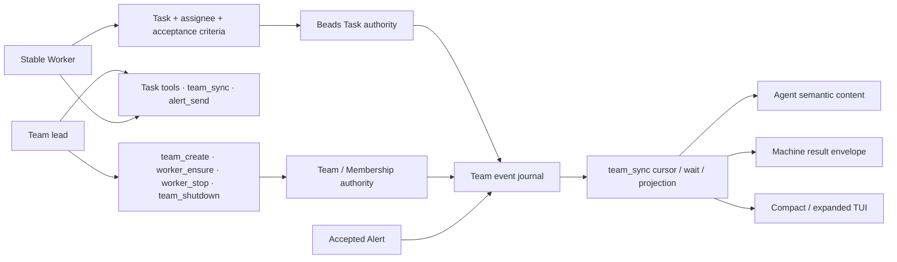

# PiTeams evergreen context

Updated: 2026-07-25

Lifecycle stage: **hardening** for the Task-first coordination surface;
**sharing** begins after human review, merge, and a stopped-Team release epoch.

This is the maintained context a new human or agent should read first. It
contains only intent, decisions still in force, current status, constraints,
and next steps. Executable contracts live in source and tests; dated attempts
and observations live in the [journal](../journal/).

## Product intent

PiTeams turns one Pi Session into the lead of a Team of stable Workers. A Task
plus its assignee is the only executable work contract. `team_sync` is the
event-driven observation and wait boundary. Typed Alerts are exceptional
clarification, attention, or announcement; they never assign, advance, block,
or complete work.

The product deliberately excludes a general agent directory, cross-Team
routing, freeform work-by-message, inbox polling, runtime polling as progress,
and terminal activity as Task evidence. Exact current Membership and Pi Session
binding determine who may act; matching names, processes, panes, or environment
variables do not.

PiTeams also answers one private operation-specific Rarebit policy query. It
inhibits automatic Summary synthesis only when locked TeamConfig evidence
proves that the queried durable Pi Session is the exact active binding of one
current teammate Membership generation. It abstains for leaders, standalone,
forked, resumed-but-unbound, replaced, ambiguous, or unverifiable identities.
Rarebit owns the versioned vocabulary, deadline, fail-open behavior, and
receipt; this is not a general provider registry and does not affect manual
Summary, deterministic Rarebits, Title, attention, health, or readiness.

## Current concept graph

This milestone diagram is the high-density interface view. The concrete type,
schema, and behavior sources are linked in the next section.

## Sources of truth

Each fact has one authoritative home; other documents point to it.

| Concern | Authority |
|---|---|
| Public tool selection and TUI renderer attachment | [`PI_TEAMS_PUBLIC_TOOLS`](../../src/utils/tool-result-renderer.ts) and [`extensions/index.ts`](../../extensions/index.ts) |
| Tool parameters, descriptions, guards, and execution | TypeBox registrations in [`extensions/index.ts`](../../extensions/index.ts) |
| Machine result schema | [`PiTeamsToolResultDetails`](../../src/utils/tool-results.ts) |
| Team, Membership, Task, Alert, and event types | [`src/utils/models.ts`](../../src/utils/models.ts) |
| Exact-teammate automatic-Summary inhibition evidence | [`src/utils/automatic-summary-policy.ts`](../../src/utils/automatic-summary-policy.ts) and [`src/utils/teams.ts`](../../src/utils/teams.ts) |
| Task authority and mutation semantics | [`src/utils/tasks.ts`](../../src/utils/tasks.ts) and [`src/utils/beads.ts`](../../src/utils/beads.ts) |
| Event cursor, wait, filtering, and paging semantics | [`src/utils/team-events.ts`](../../src/utils/team-events.ts) |
| Reuse-first lifecycle recommendations | [`src/utils/team-sync-actions.ts`](../../src/utils/team-sync-actions.ts) |
| Human operating introduction | [Repository README](../../README.md) |
| Agent operating procedure | [`skills/pi-teams/SKILL.md`](../../skills/pi-teams/SKILL.md) |
| Verification intent | Contract tests and the [headless QA harness](../../scripts/tool-result-qa/README.md) |

The [contract source map](../reference.md) gives one-hop navigation without
restating these executable definitions.

## Decisions still in force

- Assigned Tasks are the sole durable work-delegation protocol; Alerts remain
  exceptional coordination. See [decision 0003](../decisions/0003-task-first-coordination.md).
- The repository keeps one evergreen current-context document. Contract truth
  migrates into types, public schemas, and tests as the component consolidates;
  docs keep intent, rationale, and pointers. See
  [decision 0004](../decisions/0004-source-allocation.md).
- Task authority, Team/Membership authority, Pi Session identity, event
  evidence, delivery presentation, runtime observation, and terminal surfaces
  remain distinct.
- Team topology and lifecycle mutations are lead-only. Shutdown deactivates a
  Membership only after exact stop evidence. Task history and authority remain.
- One live Team runs one PiTeams version; upgrades happen as a stopped and
  restarted epoch, not a rolling deployment.
- A Team epoch owns one direct terminal carrier. An inherited outer terminal
  identity cannot validate a Worker running inside a nested multiplexer; see
  [decision 0005](../decisions/0005-direct-terminal-carriers.md).

## Current status and anchors

- The public surface has ten tools and one versioned result envelope.
- The headless suite emits 39 immutable cases across all public tools without
  launching Pi, a model, tmux, or the foreground TUI.
- The last baseline full repository run passed 44 test files and 349 tests. The
  direct-carrier hardening change passed `npm run typecheck`, 121 focused
  adapter/lifecycle/contract tests, and the isolated agent-surface snapshot;
  its concurrent full-suite run reached 401 passing tests before the
  5-second snapshot-test timeout, while that snapshot passes alone in 2.46s.
- `worker_ensure` now keeps carrier lifecycle independent of Task authority: it
  reuses a live carrier, retries the same unconsumed capability when a prepared
  carrier disappeared, or resumes the exact bound Session when a later carrier
  disappeared. Multi-Task projections use one batched Beads read, lifecycle
  guards hydrate only relevant nonterminal candidates, and direct Herdr launch
  tolerates the bounded split-to-shell readiness race. Live smokes preserved
  identities across both the prepared retry and exact-Session recovery paths,
  then delivered and closed post-recovery work; the complete full run passed
  all 50 files and 407 tests. Incident and validation evidence is retained in the
  [worker-recovery journal](../journal/2026-07-25-worker-recovery-and-task-hydration.md).

## Constraints and open work

One live blocker remains below the recovered Worker lifecycle: ordinary
`team_sync` intermittently times out in the single underlying Beads `list`
command while live Workers settle Tasks. The prior N+1 hydration defect is no
longer involved. Task projection availability must be isolated from valid
Team/Worker carrier state, and any read retry must be bounded, read-only,
traceable, and tested under concurrent Beads/Dolt activity rather than hidden by
a larger timeout.

Next steps:

1. Reproduce the `bd list` contention with semantic traces and concurrent Task
   writes; determine whether Beads read-only mode, one bounded retry deadline,
   or both are supported by external evidence.
2. Make `team_sync` return a typed partial result when Task projection is
   unavailable, without misreporting zero Tasks or discarding valid Team and
   Worker carrier state.
3. Human-review the Task-first interface, terminal direct-carrier contract, and
   source allocation.
4. Merge and release only after review; restart live Teams as one version epoch.
   Any pre-change mixed-carrier Team must be stopped and recreated after
   release.
5. Reassess component stage at the next R&D kickoff. New experimental pieces
   may return to exploration without weakening anchors for the hardened core.

## Historical trail

- [Task-first problem and design](../journal/2026-07-17-task-first-agent-coordination-design.md)
- [Documentation source reallocation](../journal/2026-07-17-documentation-source-reallocation.md)
- [Task-first coordination decision](../decisions/0003-task-first-coordination.md)
- [Contract source map](../reference.md)
