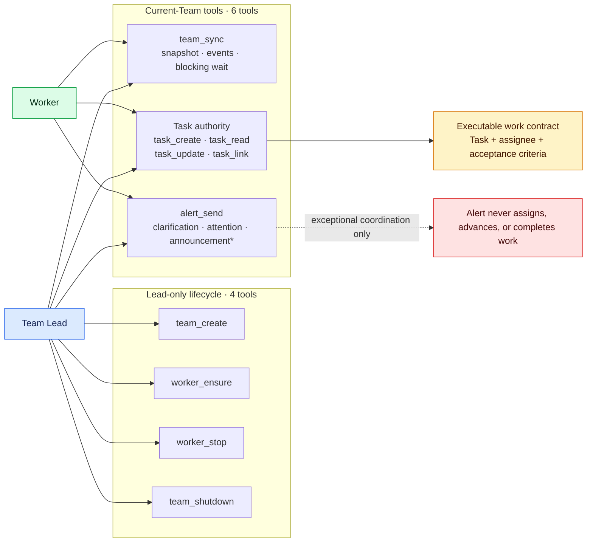
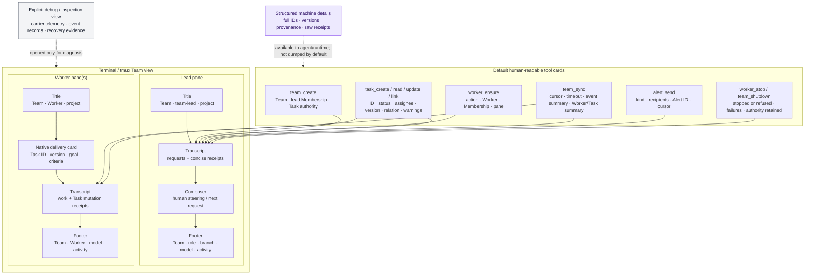

# Task-first agent coordination design

Status: implementation-aligned draft for human review

Date: 2026-07-17

## Problem

Real long-horizon use shows one control-loop failure with three symptoms:

- leads wait with shell sleeps or terminal inspection because there is no
  Task-native event wait;
- workers can receive freeform work, complete it, and reply in their own TUI
  without updating Task state;
- leads lose the current roster/workload picture, start more workers, and leave
  finished worker carriers alive.

The current 18-tool surface contributes to the problem. It exposes Task,
Message inbox, terminal/runtime inspection, lifecycle, and template authoring
as peer operations, so agents can substitute Message or terminal evidence for
the Task work protocol.

The target is a smaller replacement surface, not the current surface plus more
tools.

## Decision summary

1. A Task plus its assigned Worker is the only executable work contract.
2. Task gains one native evaluator field: `acceptanceCriteria`.
3. A stable Worker role owns Tasks; replaceable Membership/Session/runtime
   carriers deliver the work.
4. One `team_sync` operation provides initial state, incremental events, and a
   blocking wait. It replaces separate list, inbox-read, runtime-check, and
   proposed Task-wait tools.
5. The public Message/inbox model is removed. One narrow `alert_send` operation
   emits exceptional clarification, attention, or announcement events.
6. No delivery event automatically starts, closes, reassigns, expires, or
   shuts down work.

## Interface diagrams

The same coordination model has three deliberately separate projections. The
agent tool surface expresses allowed intent, the TUI renders concise human
evidence, and the event mechanism moves committed references between exact
Sessions. None is a competing Task or Worker authority.

### 1. Leader- and Worker-facing tools



`*` Team-wide announcements are lead-only. Workers retain the shared Task,
sync, and Alert operations, but topology and carrier lifecycle stay with the
lead. `worker_ensure.profile` supplies standing role context; only a Task can
carry executable work.

### 2. Human-facing TUI elements



The default TUI projection is a receipt, not serialized backend state. It
shows the coordinates a human needs for the next decision and keeps complete
machine details in structured tool results. Raw Task bodies, event JSON, inbox
history, prompt bodies, and runtime telemetry appear only when explicitly
inspected. The readable lane identity is Team + role/Worker + project; opaque
Membership, Session, PID, and pane identifiers are secondary evidence.

### 3. Event acceptance, delivery, and blocking wakeup

```mermaid
sequenceDiagram
  autonumber
  actor C as Calling Lead or Worker
  participant S as team_sync waiter
  participant T as PiTeams tool
  participant A as Owning authority<br/>Beads / Team / Alert
  participant O as Recovery outbox
  participant J as Team event journal
  participant R as Exact-Session router
  participant P as Recipient Pi Session

  S->>J: read events after cursor
  S->>J: register watch, then recheck

  C->>T: mutate Task, Worker, or Alert
  T->>A: authorize and commit
  A-->>T: authoritative post-state + version

  alt event append succeeds
    T->>J: append compact typed event + monotonic cursor
    J-->>S: filesystem notification hint
    S->>J: read matching events after cursor
    S->>A: hydrate referenced Task / Worker state
    A-->>S: fresh authoritative projection
    S-->>C: cursor + events + projection

    par exact-Session attention path
      J-->>R: accepted event available
      R->>A: resolve current Membership / Session
      alt assignment, explicit Alert, or high-signal transition
        R->>P: native context delivery / steer
        P-->>R: presentation ack after successful turn
      else routine checkpoint
        R-->>R: leave available to team_sync; do not start a turn
      end
    end
  else commit succeeded but append failed
    T-->>C: post-state receipt + delivery/event warning
    T->>O: persist authority ID + object ID + committed version
    O->>A: re-read committed state on sync or restart
    O->>J: append repaired event with next cursor
  end

  Note over A,J: The event carries a reference and version, not a copy of authority.
  Note over R,P: Presentation acknowledgement never changes Task status.
```

Commit precedes notification. `team_sync` uses check-register-check so a
mutation between its first read and watcher registration is still observed;
filesystem notifications are hints, and the cursor-based journal is the
ordered evidence. Task and Worker events are hydrated from current authority
before return. Delivery acknowledgement records presentation to one exact
Session generation and has no semantic completion meaning.

## Target ontology

- **Team**: one authorization, coordination, and Task-authority boundary.
- **Worker**: one stable Team-scoped role/capability and valid Task assignee.
- **Membership**: one replaceable execution generation carrying a Worker.
- **Pi Session**: the durable reasoning carrier bound to one current
  Membership.
- **Task**: one durable goal and evaluator contract with state, relations,
  evidence, and one assigned Worker.
- **Assignment**: the Task-to-Worker relation. Delivery resolves it to the
  current exact Membership and Session.
- **Team Event**: a typed, ordered observation of committed Task, Worker, or
  Alert state.
- **Alert**: exceptional directed clarification, attention, or announcement;
  never a work assignment or completion record.
- **Runtime/terminal observation**: diagnostic carrier evidence, never Task
  progress.

Task ownership must not bind directly to a Membership generation. A crash,
Session resume, or explicit Worker recovery changes the carrier, not the
semantic owner. Exact Membership/Session identity remains mandatory for write
authorization and delivery.

## Minimal tool contract

### Team

#### `team_create`

Creates the Team, lead identity, and Task authority. It does not create workers
or work.

#### `team_sync`

One read operation serves three modes:

```ts
team_sync({
  team_name: string,
  cursor?: string,
  wait_ms?: number,
  task_ids?: string[],
  event_types?: Array<"task" | "worker" | "alert">
})
```

- With no cursor, return the compact current Team projection and a cursor.
- With a cursor and `wait_ms: 0`, return immediately with later events.
- With a cursor and positive `wait_ms`, block until a matching event or
  timeout, then return the new cursor and changed authoritative projections.

The compact projection contains:

- Team lifecycle and Task-authority identity;
- stable Workers and current Membership/Session carrier presence;
- separate freshness-labelled runtime and terminal observations;
- each Worker's nonterminal Task IDs/statuses;
- compact Task summaries and versions;
- evidence-backed assessments such as `reuse`, `recover`, `reassign`, or
  `stop_idle`.

It excludes Task bodies unless changed/requested, Alert history before the
cursor, terminal content, prompt bodies, and historical Team enumeration.

`team_sync` replaces all of these default agent operations:

- `task_list`;
- `check_teammate`;
- `read_inbox`;
- a separate `team_read`;
- a separate `task_wait`.

#### `team_shutdown`

Stops current Worker carriers while preserving Team, Worker, Task, and event
history. It reports unfinished Tasks and partial stop failures without mutating
Task state.

### Worker

#### `worker_ensure`

```ts
worker_ensure({ team_name, name, profile, cwd, model?, thinking?, replace?: false })
```

- reuse a matching current Worker carrier without interruption;
- recover the exact Session when the Worker exists but its carrier stopped;
- start a new Membership only when the stable Worker has no carrier;
- fail on an incompatible live profile unless replacement is explicit;
- refuse implicit replacement when nonterminal Tasks remain assigned.

`profile` is standing role/capability context, not the current work request. It
is injected as system context and is never sent as an Alert.

#### `worker_stop`

Stops one carrier and defaults to refusing while that Worker has nonterminal
Tasks. It never closes, unassigns, or reassigns Tasks as a side effect.

### Task

#### `task_create`

Creates one goal-driven Task. New assigned Tasks require a nonempty
`acceptance_criteria`.

#### `task_read`

Returns the complete authoritative Task and exact version needed for a later
conditional write.

#### `task_update`

Mutates content, assignee, status, or append-only evidence. A transition to
`blocked` or `closed` requires an evidence note in the same mutation.

#### `task_link`

Keeps the existing typed `parent`, `blocked_by`, and `related` graph mutation
separate because graph validation is an irreducible semantic operation, not a
generic field update.

### Alert

#### `alert_send`

```ts
alert_send({
  team_name: string,
  to: WorkerName | "team-lead" | "*",
  kind: "clarification" | "attention" | "announcement",
  task_id?: string,
  task_version?: string,
  text: string
})
```

Clarification and attention should reference the relevant Task when one
exists. `to: "*"` is a Team announcement and may be lead-only. An Alert cannot
assign work, change goals/criteria, report durable progress/blocking, declare
completion, or carry the only copy of a decision.

There is no `read_inbox`. Accepted Alerts arrive through native exact-Session
delivery and appear in `team_sync` events after the caller's cursor. Delivery
acknowledgement means presentation across a successful turn boundary, never
Task completion.

## Task contract and worker loop

The Task projection stays small:

```ts
interface Task {
  id: string;
  title: string;
  description: string;          // goal, context, constraints
  acceptanceCriteria: string;   // observable success/evaluator contract
  design?: string;
  status: "open" | "in_progress" | "blocked" | "closed";
  assignee?: WorkerName;
  notes?: string;               // append-only checkpoint/result evidence
  relations: TaskRelation[];
  version: string;
  provenance: TaskProvenance;
}
```

Beads already exposes native acceptance criteria, so this is one missing
semantic field rather than another PiTeams-only workflow entity.

Status meaning is procedural and enforceable at the useful boundaries:

- `open`: proposed or assigned, not actively accepted;
- `in_progress`: the Worker explicitly accepted and is working;
- `blocked`: the Worker cannot meet the criteria; the mutation includes the
  blocker, evidence, and needed decision/input;
- `closed`: the criteria were met and self-verified; the mutation includes the
  result and verification evidence.

Every assigned-Task turn receives the same concise protocol:

1. The Task is the work contract; Alerts and Worker profile are not.
2. Move understood long-horizon work to `in_progress` before execution.
3. Iterate within a bounded budget and verify against `acceptanceCriteria`.
4. Before a final TUI response, persist `closed` with verification,
   `blocked` with the needed action, or an honest `in_progress` checkpoint.
5. Never report progress or completion only in prose or an Alert.

If a Task-triggered successful turn ends with the Task still nonterminal and no
Task mutation, retain a pending obligation and emit at most one reminder per
Task version. Do not auto-mutate Task state.

## Event-driven mechanism

### Event types

```ts
type TeamEvent =
  | {
      type: "task";
      cursor: string;
      ref: { authorityId: string; taskId: string; version: string };
      change: "created" | "assigned" | "design" | "note" | "status" | "relation";
      actor: WorkerName;
      at: string;
    }
  | {
      type: "worker";
      cursor: string;
      worker: WorkerName;
      membershipId: string;
      phase: "prepared" | "session_bound" | "stopped" | "failed";
      at: string;
    }
  | {
      type: "alert";
      cursor: string;
      alertId: string;
      from: WorkerName;
      to: WorkerName | "*";
      taskRef?: { taskId: string; version?: string };
      kind: "clarification" | "attention" | "announcement";
      text: string;
      at: string;
    };
```

### Commit and delivery order

1. The owning authority commits Task, Worker, or Alert state.
2. An outbox appends a compact typed Team Event with a monotonic cursor.
3. The delivery router selects exact current Sessions:
   - Task assignment/change to the assignee;
   - `blocked`, `closed`, review-attention, and Worker failure to the lead;
   - Alert to its explicit recipient(s).
4. If an agent is blocked in `team_sync`, the event resolves that call. If a
   high-signal recipient is settled, native steer can start a turn.
5. Before returning a Task/Worker event, `team_sync` hydrates current authority
   state. The event is evidence that something changed, not the business-state
   answer.
6. Presentation acknowledgement is recorded per exact Session. It never
   changes Task status.

Routine Task checkpoints should not always steer the lead; they remain
available to `team_sync`. Native wakeups are for high-signal transitions and
explicit Alerts, which avoids turn storms.

### Recovery and lost-wakeup safety

- Mutation receipts carry the post-state version and latest event cursor.
- `team_sync` performs check-register-check around its wait.
- Filesystem notifications are hints; dropped hints do not lose state.
- On explicit sync/restart, targeted authority reconciliation repairs a commit
  that occurred before its event append and detects direct external Task writes.
- Multiple readers do not destructively consume events; each Session advances
  its own supplied cursor.
- Wait timeout/abort/stale Session tears down watchers and changes no authority.

## Current-to-target surface

The target has 10 default tools, down from 18:

- Keep: `team_create`, `team_shutdown`, `task_create`, `task_read`,
  `task_update`, `task_link`.
- Replace `spawn_teammate` with idempotent `worker_ensure`.
- Replace `teammate_shutdown` with guarded `worker_stop`.
- Replace `task_list` and `check_teammate` with `team_sync`.
- Replace `send_message` and `broadcast_message` with `alert_send`.
- Remove `read_inbox` completely.
- Move `report_stale_agent_sessions` and detailed runtime inspection to
  operator diagnostics, outside the default agent surface.
- Move predefined Team/Agent listing and template save/create operations to
  configuration artifacts or CLI, outside live coordination.

This is a net surface reduction while adding the missing behavior. It does not
add `team_read`, `task_wait`, event-read, inbox-read, and runtime-read as
separate concepts.

## Lead loop

1. `team_sync` to recover the current Team/Worker/Task projection.
2. Reuse or recover a suitable Worker with `worker_ensure`; start a new one only
   when necessary.
3. Create/assign a Task with goal, criteria, constraints, and verification.
4. Call `team_sync` with the returned cursor and relevant Task IDs to block on
   changes; do not shell-sleep or inspect runtime for progress.
5. On `blocked`/`closed`, inspect Task evidence, then continue, reuse, or stop
   the Worker.
6. Before finishing, `team_sync` once more and reconcile unfinished Tasks and
   live carriers; `team_shutdown` when done.

## What not to automate

- Delivery does not imply `in_progress`.
- A successful assistant turn or TUI reply does not imply completion.
- Runtime silence does not expire or reassign a Task.
- Closing one Task does not stop its Worker.
- Event projection does not replace Task or Worker authority.
- Alert acceptance does not change Task state.

## Migration

### 1. Contract and instructions

- Define the 10-tool target in tests and docs.
- Make duplicate spawn fail instead of replacing an existing Worker.
- Reframe spawn prompt as role profile and remove initial work Message.
- Add the every-turn Worker and Lead protocols.

### 2. Task and Team events

- Map native Beads acceptance criteria through projection and versioning.
- Require evidence notes for `blocked` and `closed`.
- Implement the general Task/Worker event outbox, cursor, reconciliation, and
  `team_sync` modes.
- Make review Task-only through Task design/note plus high-signal event.

### 3. Worker lifecycle

- Introduce stable Worker records and `worker_ensure`/`worker_stop`.
- Preserve exact Membership/Session delivery and existing shutdown safeguards.
- Add reuse/recover/stop assessments to `team_sync`.

### 4. Alert cutover and surface removal

- Convert needed direct/broadcast coordination to typed `alert_send` events.
- Remove inbox reads and the public Message model.
- Move template and diagnostic tools out of the default allowlist.
- Preserve legacy Message files as historical evidence during migration, not
  as a live fallback authority.

## Verification

Deterministic tests must cover event ordering, check-register-check waiting,
timeout/abort, multiple cursors, exact-Session delivery, commit/outbox crash,
direct Task writes, same Worker across Membership recovery, duplicate start,
Task evidence requirements, Task-only review, and shutdown with unfinished
work.

The real-trace evaluator succeeds when:

- normal progress uses no shell sleep or terminal inspection;
- every executable request has one Task, Worker, and acceptance criteria;
- workers persist `in_progress` and then `blocked` or `closed` evidence;
- completion Alerts approach zero;
- sequential work reuses Workers and bounds Membership growth;
- unneeded carriers are stopped;
- wake latency, idle authority calls, event growth, and lost wakeups remain
  bounded and measured.

This document is a draft assessment, not an accepted decision. Stable choices
should move to a numbered decision and current-context docs only after human
review.
