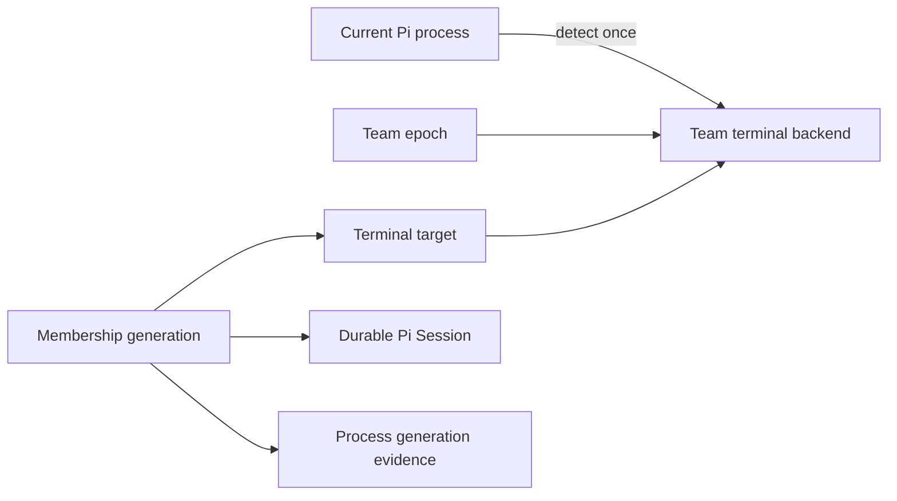

# Terminal backend decoupling: Herdr and tmux

Date: 2026-07-25

Status: implemented and validated

## Problem

PiTeams already routes terminal operations through `TerminalAdapter`, but the
Team authority doesn't persist which adapter owns its terminal surfaces.
`extensions/index.ts` instead caches whichever adapter the current process
detects, while `Member.tmuxPaneId` stores pane IDs from every adapter. A resumed
lead can therefore pass a Herdr, cmux, or iTerm target to tmux (or the reverse),
and Herdr sessions that carry nested `TMUX` variables select tmux before the
outer Herdr workspace.

The intended invariant is stronger: one live Team epoch owns terminal surfaces
in exactly one backend. Pi Session identity, Membership identity, and terminal
surface identity remain separate.

## Ontology

- **Terminal backend**: the implementation family that creates and controls
  terminal surfaces, identified by a stable registry ID such as `herdr` or
  `tmux`.
- **Terminal target**: one backend-owned pane or window ID. It isn't a Pi
  Session, process, or Membership identity.
- **Team terminal binding**: the backend chosen when a Team epoch is created.
  Every current Member terminal target must name that backend.
- **Current process terminal**: environmental evidence used to choose a backend
  only at Team creation and to refresh the current Member's target. It never
  overrides an existing Team binding.

## Design decisions

1. Herdr detection precedes tmux because Herdr may legitimately host a nested
   tmux process and exports `HERDR_ENV`, `HERDR_PANE_ID`, and `HERDR_TAB_ID`.
2. New TeamConfig records persist the selected backend. Lifecycle operations
   resolve that ID directly; they don't redetect and don't infer ownership from
   target prefixes.
3. New Member records use a typed terminal target containing backend, kind, and
   ID. Legacy `tmuxPaneId` and `windowId` remain read-compatible during this
   hardening change, but new writes use the typed field.
4. A target whose backend differs from its Team fails closed before spawn,
   health, compensation, stop, or shutdown. Exact Membership and topology lease
   ordering remains unchanged.
5. Herdr launches with structured `herdr agent start ... -- <argv...>`, keeping
   command arguments and PI_* environment values out of shell interpolation.
   New agents stay in the lead's originating Herdr tab. Herdr pane close/get
   provide stop evidence; rename sets the current pane title.
6. Existing non-Herdr adapters remain available. This change establishes the
   backend seam and hardens tmux/Herdr parity without making terminal state a
   new public agent tool.

## Verification plan

- Unit-test Herdr command mapping, JSON parsing, detection with nested tmux,
  close idempotence, alive checks, and title targeting.
- Contract-test Team backend persistence and resolution, target/backend mismatch
  refusal, nested Herdr selection, and tmux behavior.
- Adapt launch compensation, lifecycle resume, worker stop, and shutdown tests
  to typed targets while retaining explicit legacy-read coverage.
- Run `npm run typecheck`, focused tests, then the full `npm test` suite.
- Perform a live Herdr smoke test only after stopping any pre-change Team epoch;
  a live Team doesn't roll terminal backend implementations.

## Session admission seam (2026-07-25, after live testing)

Live tmux and Herdr runs both passed, and the Herdr run surfaced a defect in the
*failure mode* rather than the decision. Six teammate processes launched into
tmux for a Herdr-bound smoke Team were correctly refused, but the refusal was a
`throw` inside `session_start`, which aborted the handler and left six live-but-
unbound Pi processes idling in their panes. The
guard prevented the corruption it was written for; it just failed loudly at the
wrong layer and silently at the operator's.

The corrected ontology separates three things the old code fused into one
throwing expression at four call sites:

- **Session terminal placement** — a derived observation of where the current
  process sits relative to its Team's binding: `placed`, `unlocated`, or
  `foreign`. Pure, total, and never throws.
- **Team session admission** — the policy over that observation: `admitted`
  (carrying exactly the Member update it may persist) or `refused` (carrying its
  own remedy text and process disposition).
- **Refusal application** — the single effect site in the extension.

A foreign process must never bind, because its Membership would then name a
terminal surface in a backend the process isn't in, and every later lifecycle
operation would target the wrong surface while reporting success. Refusal
therefore keeps the existing Session and terminal target untouched, so a second
launch of a name can't hijack the Membership from the live process that owns it.

Whether refusal also *ends* the process is encoded in the type rather than left
to each call site. A launcher-spawned teammate (`PI_AGENT_NAME` in env) that
cannot serve its Team has no reason to exist, and leaving it idle hides the
launcher bug behind a live pane, so it exits via `ctx.shutdown()`. A Session
recognized from its own file is the operator's terminal, so it degrades to an
unbound agent instead of being closed underneath them.

Two smaller corrections fell out of the refactor. Session start no longer routes
through `terminalForTeam`, so one Member's malformed target can no longer fail an
unrelated Member's startup; that validation stays where dispatch happens.
And the legacy untyped write now accepts a tmux pane environment as tmux
evidence but refuses a non-tmux backend's own target, so this path can no longer
manufacture a record filing a Herdr pane ID under `tmuxPaneId` — the exact shape
of the cross-backend corruption.

`currentTerminalForTeam` still throws in tool paths such as `worker_ensure`,
which is correct: a tool call should fail loudly, while process startup must
decide.

## Verification results (2026-07-25)

`npm test` (typecheck plus vitest) is green at 398 tests across 50 files. The
backend seam itself is covered by 29 of those, including 11 `session-terminal`
unit tests over placement and admission and 2 contract tests proving a refused
launcher-spawned teammate neither binds nor survives while a refused resumed lead
stays open. The remaining 16 are: 7 `HerdrAdapter` unit tests, 2
registry precedence tests proving Herdr wins over inherited nested tmux
identity, and 7 `terminal-backend.contract.test.ts` cases covering backend
persistence, cross-backend Member refusal, redetection-free resolution, refusal
to spawn or resume from a different current backend, ambient-dispatch refusal
for legacy Teams that hold terminal targets, window-target refusal on a
pane-only backend, and Herdr target refresh that ignores nested `TMUX_PANE`.

All three reviewer findings are closed and each has a test: ambient dispatch for
legacy targets now throws in `terminalForTeam` (`team-terminal.ts`), incompatible
`window` targets are rejected by `assertTargetSupportedByTerminal` before stop
evidence is claimed, and `HerdrAdapter.kill` refuses to close the last pane in a
workspace because that would delete the workspace.

Adapting the lifecycle suites was the last offline step. `release-p1`,
`topology-lifecycle`, and `ergonomic-tool-contract` created Teams without the
binding that `team_create` now writes, so the fail-closed guard correctly
refused them. Their helpers now bind the detected backend at creation, mirroring
production, while Members keep legacy `tmuxPaneId` values so the legacy read path
stays covered.

A pre-change Team demonstrated the original defect in durable form: its lead
held one Herdr target while a teammate held a tmux target, with no
`terminalBackend` recorded. Lifecycle operations on it failed closed with the
migrate-or-recreate message rather than dispatching across backends. It was
stopped and recreated before the live smoke test.

## Follow-up: direct-carrier launch evidence

A live API smoke found that the configured `herdr` launcher was an external
compatibility shim. It translated the
old `herdr agent start <name> --cwd --tab --split` request into `pane split`
plus `tmux -L piteam-* new-session`, so both Workers correctly refused startup
under the direct-carrier contract and their Herdr panes exited. The smoke Team
was then closed with its two Tasks closed as failed-launch evidence.

Herdr 0.7.5 instead exposes a two-stage direct carrier API: `pane split` creates
the target surface and `agent start <name> --kind pi --pane <id> -- <pi args>`
starts the canonical Pi process in that existing pane. The adapter now calls
that API directly, forwards the Pi Team and proxy environment through the pane,
and closes the fresh pane if named-agent startup fails. A direct live command
smoke returned `interactive_ready: true` with only Herdr's shell and Pi/node
processes; no new `piteam-*` tmux server was created. The current Pi lead
process still has the old extension module loaded, so a fresh Pi Session is
required before rerunning the PiTeams API happy-path smoke.

## Fresh-session PiTeams API smoke

After restarting the Pi lead Session, a fresh Team was created through the
PiTeams API and a Worker was ensured with the configured Codex model and medium
thinking. Its runtime record reported `ready: true`; the durable Membership
bound its carrier to a Herdr pane. The assigned Task closed after reporting
Herdr environment evidence, no `TMUX` or `TMUX_PANE`, and Pi parentage on a
Herdr tty rather than a `piteam-*` tmux server. The Worker and Team were stopped
cleanly after the Task closed.
