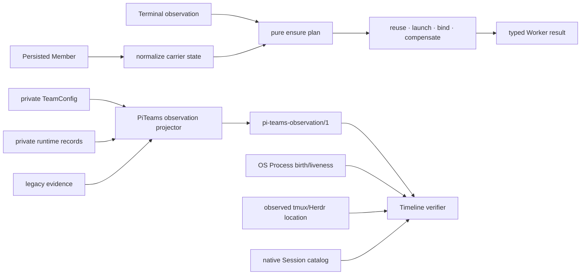

# Worker correctness and read-only observation protocol plan

Date: 2026-07-26
Status: accepted plan; Worker lifecycle implementation complete
Target branch: `feat/terminal-backend-decoupling`

## Trigger and intent

Two hardening needs share one design rule: PiTeams must expose semantic
contracts instead of making callers reconstruct meaning from implementation
records.

Before this hardening, `worker_ensure` implemented its carrier-state matrix and
two recovery modes inline. Optional Member fields, duplicated effects, and
free-form result strings made omissions and behavioral drift easy even though
the recovery behavior was validated.

Timeline is a read-only external consumer of evidence under `~/.pi/teams`. Its
previous collector joined private `config.json`, runtime, lead-session, PID,
and legacy terminal records. That private layout had already diverged for lead
and teammate process generations. PiTeams therefore owns a small versioned
observation projection; Timeline remains the independent authority for OS
Process liveness/birth, observed terminal location, and native Session
existence.

The delegated lifecycle and observation work was developed as two independently
reviewable streams. Before publication, it was combined with its prerequisite
terminal and recovery work into the four semantic release commits recorded in
the result section.

## Ontology and authority boundary

The irreducible lifecycle concepts are:

- **Membership episode**: one immutable `membershipId` generation for one named
  Team participant.
- **Prepared carrier**: a current Membership with one unconsumed launch
  capability and no bound Pi Session.
- **Bound carrier**: a current Membership bound to one exact durable Pi Session.
- **Carrier observation**: recorded target observed live or missing by the
  Team-owned terminal adapter.
- **Ensure plan**: reuse, retry the same first binding, resume the exact Session,
  create a new Membership, or refuse invalid evidence.
- **Recorded process binding**: PID and start time recorded by PiTeams for one
  exact Membership. It is evidence, not a liveness claim.
- **Observation snapshot**: a versioned read-only projection of Membership
  episodes and their optional Session, terminal-placement, and process-binding
  evidence.

PiTeams decides Membership identity/lifecycle and publishes only recorded
bindings. It does not claim that a PID is alive, a target is still occupied, or
a Session is currently owned. Timeline independently verifies those facts.
Tasks, Alerts, Messages, prompts/profiles, model data, terminal content, command
lines, environment, usage/spend, summaries, Rarebits, and arbitrary extension
state are outside this protocol.

## Worker lifecycle implementation

1. Add an internal discriminated carrier-state normalization over persisted
   Member optionals. Do not migrate or widen the persisted TeamConfig schema.
2. Add a pure exhaustive `planWorkerEnsure` transition function covering absent,
   prepared, bound, invalid, and live/missing target observations.
3. Replace free-form Worker action and recovery-mode strings with literal unions
   and use exhaustive checks where outcomes are rendered/executed.
4. Consolidate prepared-first-binding retry and exact-Session resume through one
   recovery executor with mode-specific argv/binding inputs and shared spawn,
   target persistence, compensation, and receipt behavior.
5. Add table-driven transition tests and dependency-budget tests proving:
   `worker_ensure` performs zero Task/Beads reads; `team_sync` retains one list
   plus bounded batched hydration; lifecycle guards hydrate only relevant
   nonterminal Tasks; unrelated Tasks cannot affect Worker ensure/stop.

The refactor must preserve existing public tool text, Membership/Session
identity, launch compensation, terminal-backend authority, and runtime-not-
observed semantics unless a typed result fixes an actual inconsistency.

## Observation protocol implementation

The stable surface is one package projector plus its canonical TypeScript and
JSON Schema. Consumers pass a Teams root (default `~/.pi/teams`) and never know
private filenames. No new agent tool and no Task/team_sync coupling is added.

Proposed top-level shape:

- `schema: "pi-teams-observation/1"`
- `generatedAt`, `producerVersion`
- `availability: available | partial | unavailable`
- `teams[]`
- typed `issues[]`

Each Team contains Membership episodes. An episode exposes only:

- required `membershipId`, `teamName`, `memberName`, and
  `coordinationRole: lead | teammate`;
- lifecycle `current | ended`, joined time, and available end evidence;
- optional typed private Pi Session locator;
- optional typed terminal target;
- optional Membership-matched recorded process binding
  `{membershipId,pid,processStartedAt}`;
- optional readiness as non-authoritative evidence;
- typed episode issues.

Projection rules:

- Perform no writes and acquire no producer locks. Read each Team through
  config-A/runtime/config-B sampling, retry once when the config changes, and
  stop further work under one total deadline or AbortSignal while preserving
  sound completed Teams.
- Isolate corrupt Teams and malformed episodes instead of poisoning the
  snapshot; preserve every distinct Membership episode.
- Include a process binding only when the runtime record has a valid PID/start
  and its `membershipId` exactly matches the episode.
- Never synthesize Membership IDs, infer terminal backends from target prefixes,
  or choose duplicates by filesystem order.
- Missing, legacy, or stale evidence becomes a typed issue and unsafe bindings
  are omitted.
- Unknown protocol majors fail closed in consumers; additive fields within major
  1 are compatible.
- Absolute Session locators and diagnostic source paths remain server-private
  and must not cross Timeline's HTTP/browser boundary.

Normalize the lead through `runtime/team-lead.json` using
`writeRuntimeStatus(..., membershipId)`. Retain `lead-session.json` only as
private compatibility evidence. Add producer fixtures and tests for lead and
teammate parity, replacement/history, malformed/legacy records, generation
mismatch, typed targets, per-Team failure isolation, atomic locked reads, and
privacy exclusions.

The protocol source will live under `src/public/`; an ADR will retain the
boundary rationale and point to the exported type/schema/function. Timeline's
consumer journal at HyperCarrier commit `2fda3bc` is the requirement artifact.

## Integration and verification

Both delegated implementations used isolated git worktrees based on the
pre-release recovery tip. The lifecycle refactor was integrated before the
observation protocol so each could be cross-reviewed independently. Release
history was then reshaped into the four semantic commits recorded below.
Verification required:

1. `npm run typecheck` and focused tests in each worktree;
2. main-branch cherry-pick followed by the complete `npm test` suite;
3. package-level observation fixture generation/consumption check from plain
   Node where supported;
4. independent review of public protocol minimality, privacy, generation
   correctness, and the no-Task dependency budget;
5. send Timeline the final export/schema/fixture paths and commit hash.

The open Beads `bd list` contention remains separate. This work may add call-
budget protection but must not disguise that timeout with broader retries or a
larger deadline.
