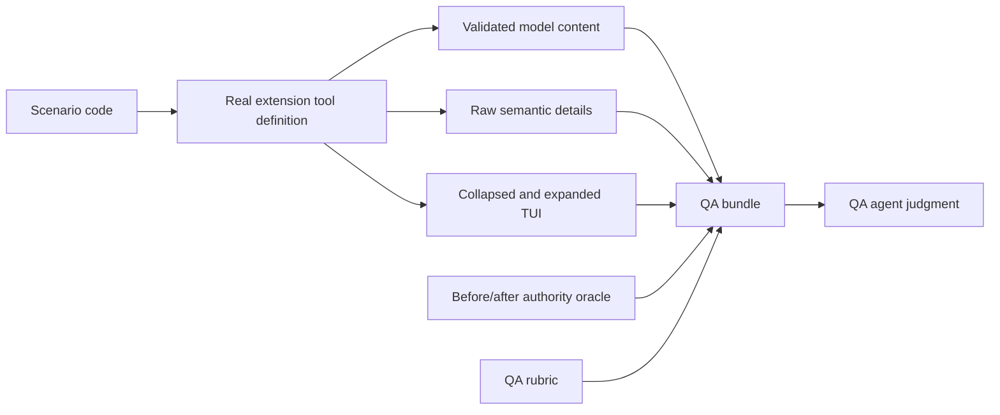

# Headless tool-result QA

This suite runs the real PiTeams extension, Team persistence, event journal,
identity checks, and Beads Task adapter without launching Pi, a model, tmux, or
the interactive TUI.



## Run

```sh
npm run qa:tool-results
npm run qa:tool-results:iterate
```

The generated, intentionally untracked artifact is:

```text
artifacts/tool-result-qa/latest.json
artifacts/tool-result-qa/history-catalog.json
```

The checked-in historical coverage catalog is
`scripts/tool-result-qa/historical-scenarios.json`. It is a curated,
privacy-safe design input derived from real Session evidence. A case becomes
reproducible only when implemented in `suite.test.ts`; the catalog itself is
not executable input.

The executable suite currently emits 39 immutable case records. Its boundary
catalog includes future cursors, event overflow, zero-recipient Alerts,
post-commit Task-create delivery degradation, duplicate relation no-ops, and
idle-Worker reuse guidance in addition to the normal lifecycle paths. Each
scenario produces exactly one `cases[]` record; deterministic fixture cleanup
is recorded separately in `fixtureTransitions` and never overwrites that case.

Set `PI_TEAMS_QA_OUTPUT` to write elsewhere. The bundle embeds the QA rubric,
so it is a complete handoff to a tester agent. Ask the agent to apply
`qaPrompt` to every `cases[]` item and return the rubric's JSON response. The
tester judges information sufficiency and excess; deterministic test assertions
continue to judge state-transition correctness.

The generated bundle is provider-neutral. Hand it to any tester agent and ask
that agent to apply the embedded `qaPrompt` to every case. Evaluator choice,
transport, credentials, and raw response retention stay outside PiTeams.

Before capture, `qa:tool-results:iterate` mines historical Pi Session JSONL
into a privacy-preserving aggregate catalog. It records current-tool projection,
outcome category, counts, and payload-size ranges, but copies no local paths,
Session coordinates, timestamps, tool-call identifiers, prompts, tool
arguments, result bodies, or detail bodies. Historical
`spawn_teammate`, `teammate_shutdown`, Message, task-list, and health calls are
mapped to their current `ensure_worker`, `worker_stop`, `alert_send`, and
`team_sync` responsibilities so recurring real failures continue to shape the
new surface.

The generated catalog deduplicates forked Session history by original tool name
and `toolCallId`, because a Pi fork can preserve the same tool-result entry in
several JSONL files. Its v2 summary reports matching records, unique records,
ignored fork duplicates, counts by current tool, and counts by outcome category.
Tool-call and entry identifiers are transient deduplication keys only. They are
never serialized, so the catalog is safe to hand to an external QA agent.

The curated manifest has three derivations:

- `direct`: the current tool and behavior were observed directly;
- `legacy-analog`: an older tool exposed the same lifecycle or coordination
  condition, which the test must re-instantiate through the current API;
- `synthetic-gap`: no historical result covers an important boundary, so the
  headless fixture must construct it explicitly.

Never replay historical calls verbatim. Older records include retired tools and
status vocabularies; use their scenario semantics, then invoke the current
ten-tool surface. `provenance.basis` records only whether a scenario came from
direct observation, a legacy analog, or a synthetic coverage gap. Raw Sessions
remain the local audit authority; no prompt, tool argument, result body, detail
body, Alert text, Worker profile, local path, Session coordinate, or runtime
identifier payload is copied into the manifest.

## What is real and what is synthesized

Real:

- the registered ten-tool surface from `extensions/index.ts`;
- Team config, Membership generation, launch capability, and Session binding;
- Beads Task creation, mutation, relations, versions, and queries;
- Alert delivery records and Team event cursors;
- lifecycle guards and stop/shutdown transitions.

Synthesized:

- a terminal adapter that tracks pane IDs and liveness in memory;
- one Worker first-session binding that consumes the real pending launch
  capability but does not start a Pi process;
- Pi's thrown-error normalization into model-visible text plus empty details;
- TUI rendering through `renderResult` at width 100, or the actual agent-content
  fallback while a tool has no custom renderer.

The suite records synthesized fixture transitions explicitly in
`fixtureTransitions`; they are setup provenance, not product evidence. Each
case keeps the exact raw semantic result, model JSON, and both allowlisted TUI
modes. `PI_TEAMS_TRACE_JSONL` remains an operational payload-free trace.

## Adding a scenario

Add calls to `suite.test.ts` using `capture(...)`. Every case declares:

- the authoritative situation;
- the next agent decision;
- the human operator's question;
- facts required in agent context;
- evidence required in machine details;
- likely agent-facing noise.

The harness snapshots compact Team/Worker/Task authority before and after the
call, invokes the real registered tool, and captures agent, machine, compact
TUI, and expanded TUI projections. Add deterministic assertions for the
intended state transition; do not encode the subjective projection verdict as
a unit-test expectation.

## Why QA judgment stays outside the test assertion

State correctness is deterministic. “Enough information” and “too much
information” depend on the declared next decision and benefit from capable
review. Keeping the QA agent as a consumer of a versioned artifact makes its
judgment rerunnable and comparable without making network/model availability a
condition for the repository test suite.
